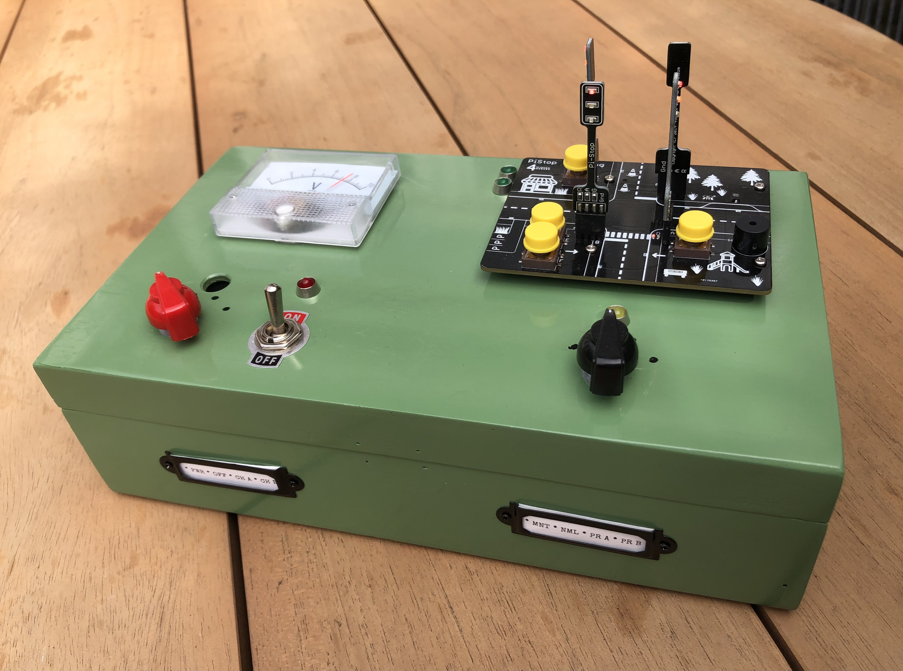
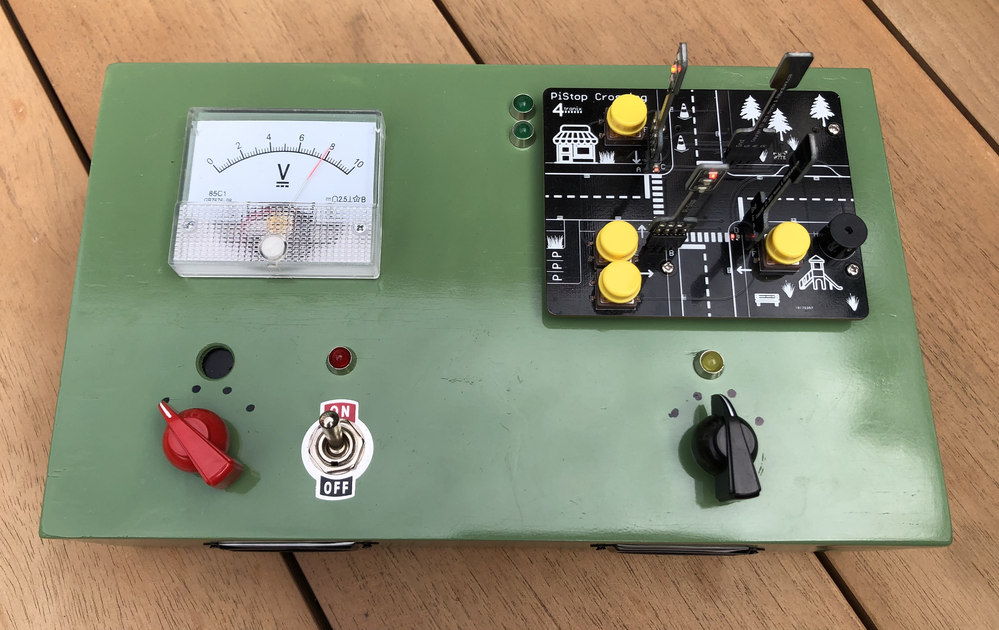
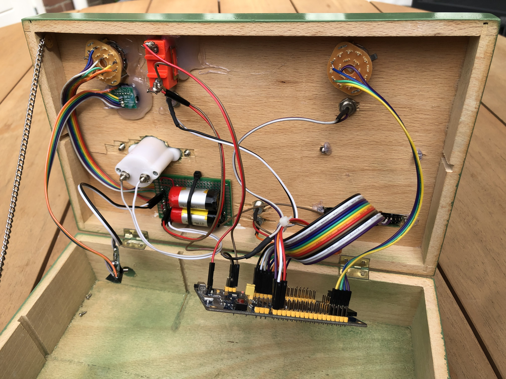

# Pistop using DESPI-M02

The Pistop is a neat little Raspberry Pi HAT that
[4tronix](https://shop.4tronix.co.uk) used to sell. They since seem to have
discontinuted this product, although they do still make the individual traffic
lights. If you don't know them, have a look around in their shop. They make all
kinds of neat STEM kits.

    

Since I had the Pistop lying around I thought this would make an ideal board to
program using Rust and further my knowledge and experience with embedded Rust. I
put it onto a nice box and added some overly complex power handling. I really
like the feel of the mechanical and rotary switches. They give such nice
feedback when operated. Much nicer than touchscreens.

    

The wiring I am not proud of. It grew organically. Perhaps I should have
designed a loom of sorts. A better custom PCB for the batteries would also have
helped. I guess this will be left as an excersise to the reader.

    

The heart of the system is a
[DESPI-M02](https://github.com/kjkoster/despi-m02-rust). It is based on the
STM32 which has lots of GPIO ports, which is nice for a project like this. The
board is not well known or even well supported. I had a few lying around unused.
I chose it mainly so that it would have a purpose.

Let me know what you think.

--
